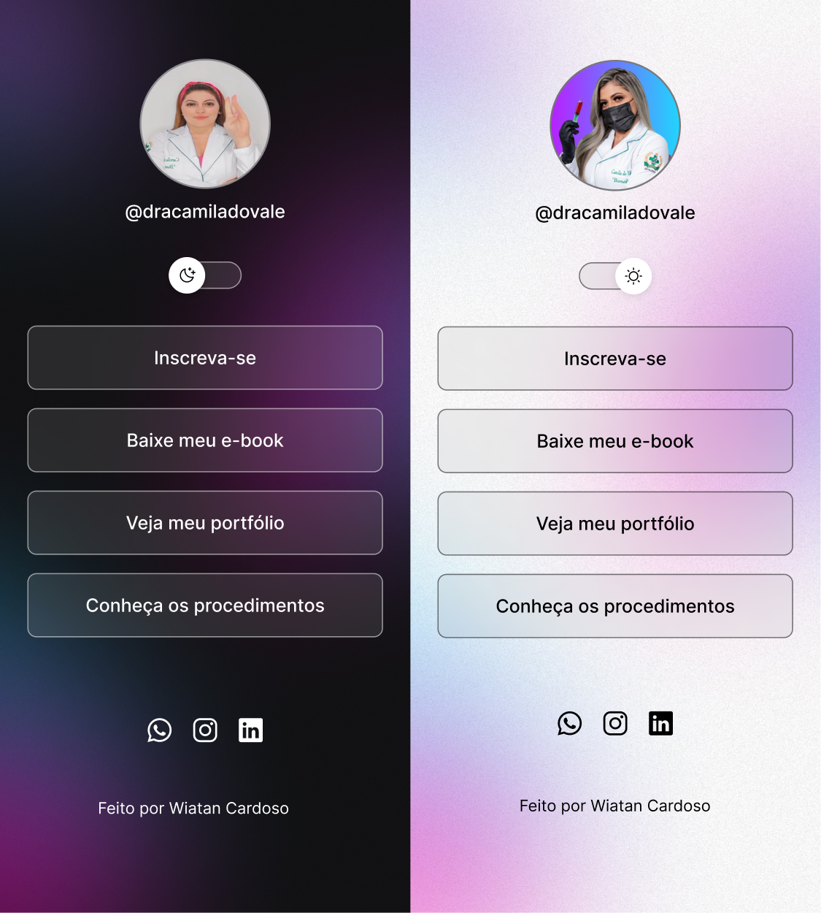

<h1 align="center"> Cartão De Visita Links </h1>

  

## 🚀 Tecnologias

Esse projeto foi desenvolvido com as seguintes tecnologias:

- HTML e CSS
- JavaScript
- Git e Github
- Figma

## 💻 Projeto

É um agregador de links para usar como cartão de visitas online.

- [Acesse o projeto finalizado, online](https://wiatancardoso.github.io/projeto_site_camila)

## 🔖 Layout

Você pode visualizar o layout do projeto através [DESSE LINK](https://www.figma.com/community/file/1187422022288947321). É necessário ter conta no [Figma](https://figma.com) para acessá-lo.

 Feito por Wiatan Cardoso 

